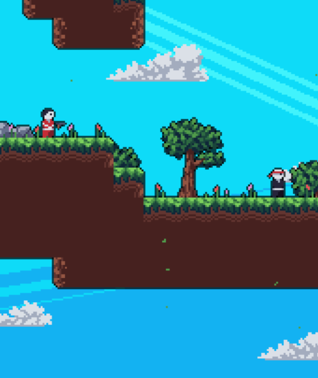

# Ctrl + Jump

A pixel-art 2D platformer built with Python and Pygame.

Run, jump, wall-slide, dash, and fight through handcrafted levels filled with enemies, projectiles, particles, screenshake, and retro-style effects.

## Preview



## Play Online

Play the browser version here:

```text
https://abdul-burale.github.io/WebGame/
```

No Python or Pygame installation is required to play the web version.

The first load may take a few seconds while the browser loads the packaged game files.

## Controls

| Key | Action |
|---|---|
| A | Move left |
| D | Move right |
| Space | Jump |
| X | Dash |
| ESC | Quit |

## How to Run

There are two ways to run the game:

1. Run the browser version locally.
2. Run the Python source version directly.

## Run the Browser Version Locally

The repository includes a prebuilt browser version of the game.

From the project root folder, run:

```bash
python -m http.server 8000
```

Then open this in your browser:

```text
http://localhost:8000/
```

If you started the server from the folder above the project, open:

```text
http://localhost:8000/WebGame/
```

The browser version does not require installing Pygame or Pygbag. It uses the already-built web files included in the repository.

The important browser build files are:

```text
index.html
ctrl+jump-web.apk
archives/repo/cp312/pygame_static-1.0-cp312-cp312-wasm32_bi_emscripten.whl
```

## Run the Python Source Version

To run the original Python/Pygame version, install Python and Pygame first.

Install Pygame:

```bash
pip install pygame
```

Then run the game from the project root:

```bash
python main.py
```

On some systems, you may need:

```bash
python3 main.py
```

## Features

- Smooth platformer movement
- Running, jumping, wall-sliding, and dashing
- Enemy patrols and projectile attacks
- Particle effects, sparks, leaves, and dash trails
- Screenshake and transition effects
- Multi-level progression
- JSON-based tilemaps
- Layered rendering with background, silhouettes, and foreground effects
- Browser-playable build using Pygbag/WebAssembly

## Project Structure

```text
WebGame/
├── main.py
├── index.html
├── ctrl+jump-web.apk
├── media/
│   └── screenshot.png
├── data/
│   ├── maps/
│   ├── sfx/
│   └── music.wav
├── scripts/
│   ├── entities.py
│   ├── tilemap.py
│   ├── particle.py
│   ├── spark.py
│   ├── clouds.py
│   └── utils.py
└── archives/
    └── repo/
        └── cp312/
            └── pygame_static-1.0-cp312-cp312-wasm32_bi_emscripten.whl
```

## Web Build Notes

The browser version was built with Pygbag, which allows Python/Pygame games to run in the browser using WebAssembly.

The web version loads:

```text
index.html
```

which then loads the packaged game archive:

```text
ctrl+jump-web.apk
```

In this project, `ctrl+jump-web.apk` is not used as a normal Android APK. It is the packaged game archive used by the Pygbag browser runtime.

## Tech Stack

- Python
- Pygame
- Pygbag
- WebAssembly
- GitHub Pages

## Credits

Built with Python and Pygame.

Assets, sound effects, and level design are either original, placeholders, or used for learning purposes.
